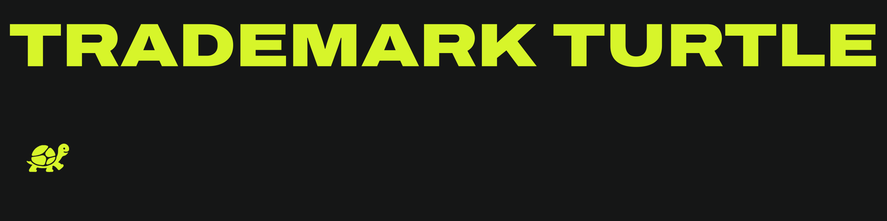

# Trademark Turtle

Trademark Turtle makes trademark compliance easy for online sellers, primarily focused on print-on-demand entrepreneurs in the merch and apparel niche. Trademark Turtle maintains a searchable United States trademark database and surfaces the functionality through the [tmturtle.merchbase.co](https://tmturtle.merchbase.co) website, a dedicated HTTP API, and the `tt` CLI native to agentic workflows.

## What Trademark Turtle does

Trademark Turtle gives sellers one place to:

- search word marks using Multi, Split, or Wildcard matching;
- look up an exact serial or registration number;
- check listing text against known trademarks;
- browse recent filings, registrations, and marks published for opposition;
- review a mark's status, owner, classes, goods and services, and source history.

Searches run against Trademark Turtle's current best-known view of the USPTO record. New source files update that view as they are processed; ingestion never takes the existing database offline.

Trademark data is informational, not legal advice. Verify consequential decisions with the USPTO or qualified counsel.

## Ways to use it

| Interface | Best for |
| --- | --- |
| [Website](https://tmturtle.merchbase.co) | Interactive search, reports, trademark detail, API-key management, public status, and help. |
| HTTP API | Typed integrations with Trademark Turtle search, reports, exact lookups, and text matching. |
| `@tmturtle/http-client` | TypeScript applications that want the server's native input and output types. |
| `tt` CLI | JSON-first shell automation and agentic workflows. |

The website uses MerchBase authentication. The HTTP API, client, and CLI use Trademark Turtle API keys. MerchBase consumes the same API as every other client.

## Data coverage

Trademark Turtle continuously processes the USPTO's bulk trademark data and keeps one live, searchable database. The initial product focuses on International Class 025—clothing, footwear, and headwear—while keeping the underlying model ready for additional classes.

Inactive and abandoned marks remain searchable because they are still part of the trademark record. Source progress and individual file problems are visible to operators without blocking customer searches.

## Repository

Trademark Turtle is a Bun and TypeScript workspace:

| Path | Purpose |
| --- | --- |
| `apps/server` | Authenticated HTTP API, PostgreSQL persistence, and USPTO ingestion worker. |
| `apps/web` | React website for search, reports, trademark detail, and operations. |
| `packages/http-client` | Typed programmatic client derived from the server contract. |
| `packages/cli` | The `tt` command-line interface. |
| `docs` | Product, architecture, reference, and operations documentation. |

Install dependencies and start the development environment:

```sh
bun install
bun run dev
```

Run the standard verification lanes:

```sh
bun run check
bun run lint
bun run build
```

See [development operations](docs/operations/development.md) for environment setup and [testing](docs/operations/testing.md) for PostgreSQL and production-shaped verification.

## Project status

Trademark Turtle is under active development. Authentication, search, exact lookups, the website, HTTP client, CLI, and production runtime are operational. The USPTO ingestion lifecycle is being simplified around direct updates to the live trademark database; the accepted design is documented in [ingestion internals](docs/internals/ingestion.md).

Start with the [documentation index](docs/README.md). Product behavior lives under [product](docs/product/README.md), system ownership under [internals](docs/internals/README.md), exact contracts under [reference](docs/reference/README.md), and maintainer workflows under [operations](docs/operations/README.md).
